# Spring-RestApi-React-E-Commerce-Project

      <a >
          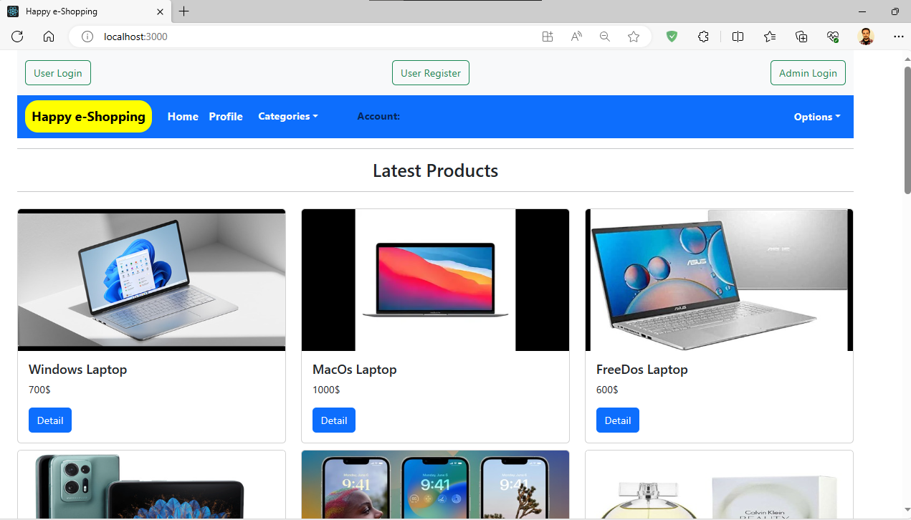 
      </a>
      
      <a >
          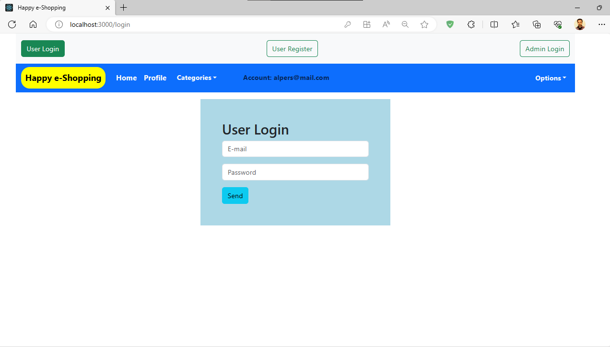 
      </a>
      <a >
          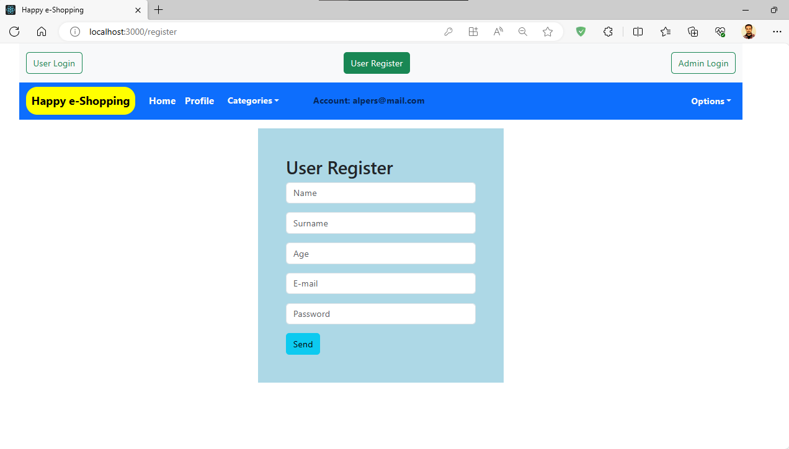 
      </a>
      <a >
          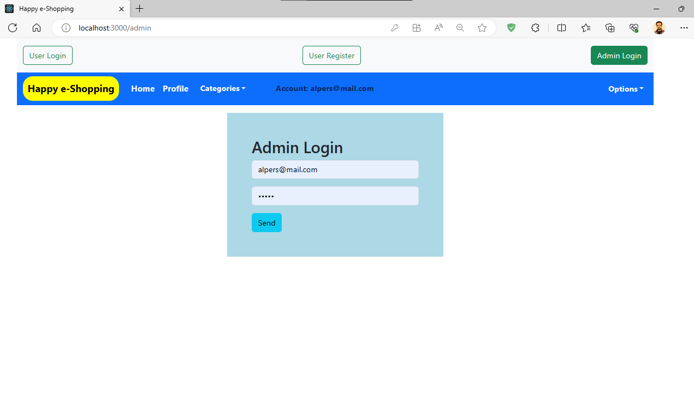 
      </a>
      <a >
          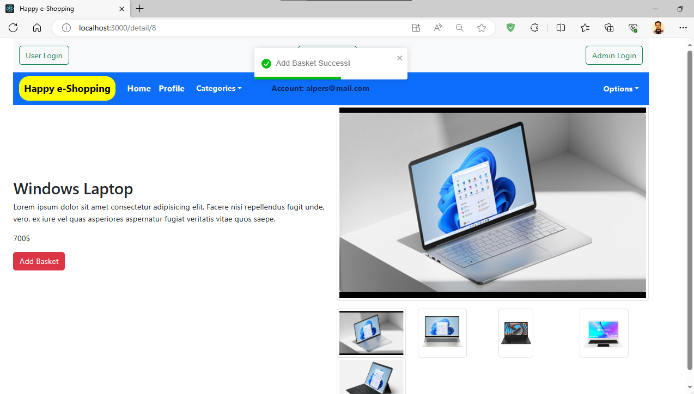 
      </a>
      <a >
          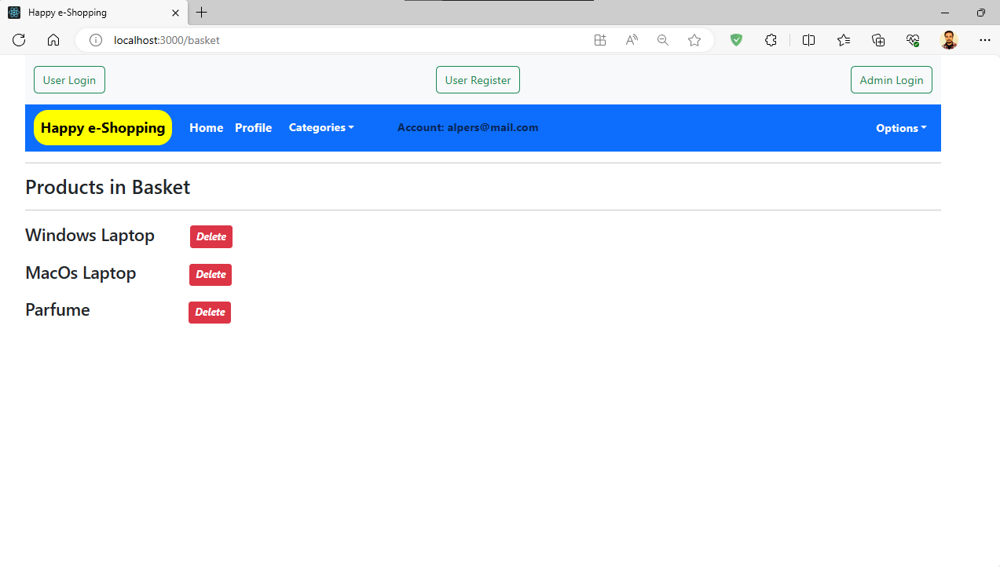 
      </a>
      <a >
          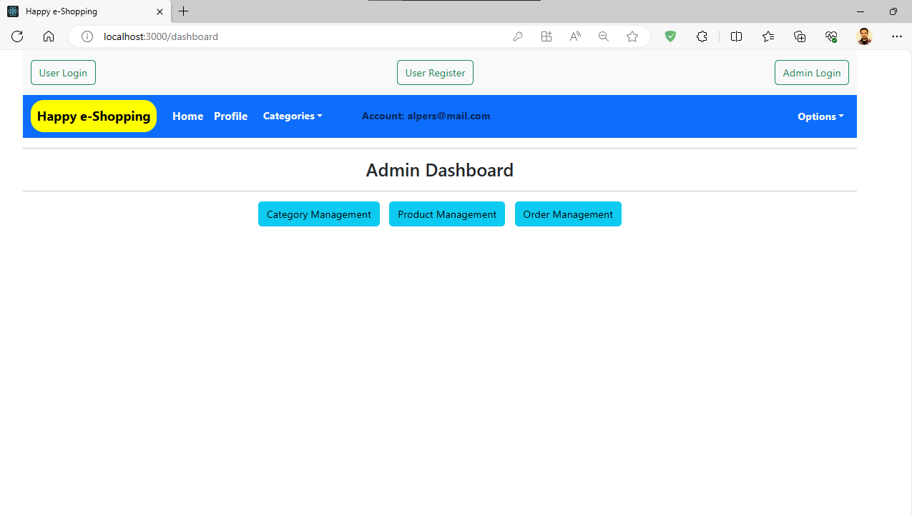 
      </a>
      <a >
          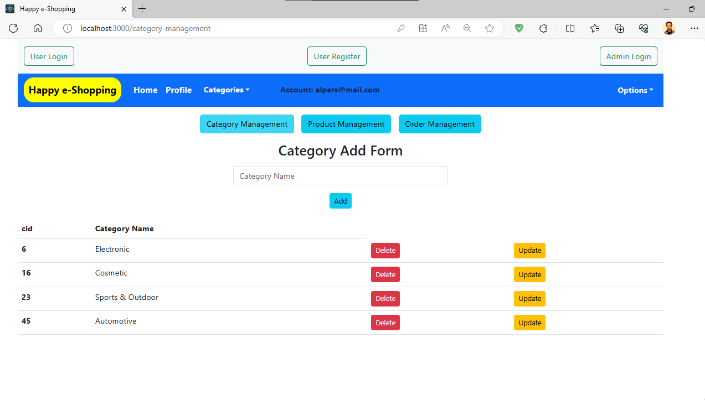 
      </a>
      <a >
          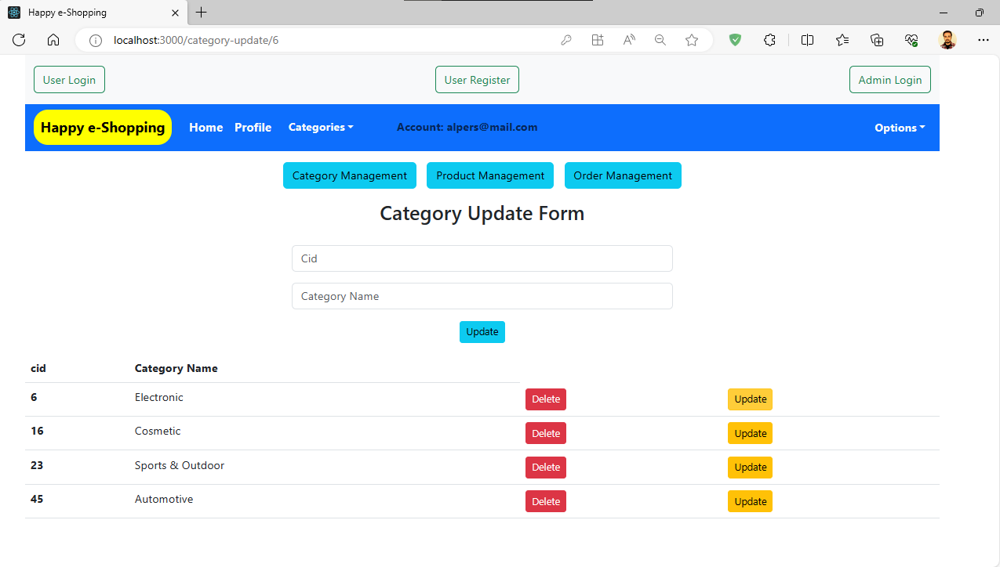 
      </a>
      <a >
          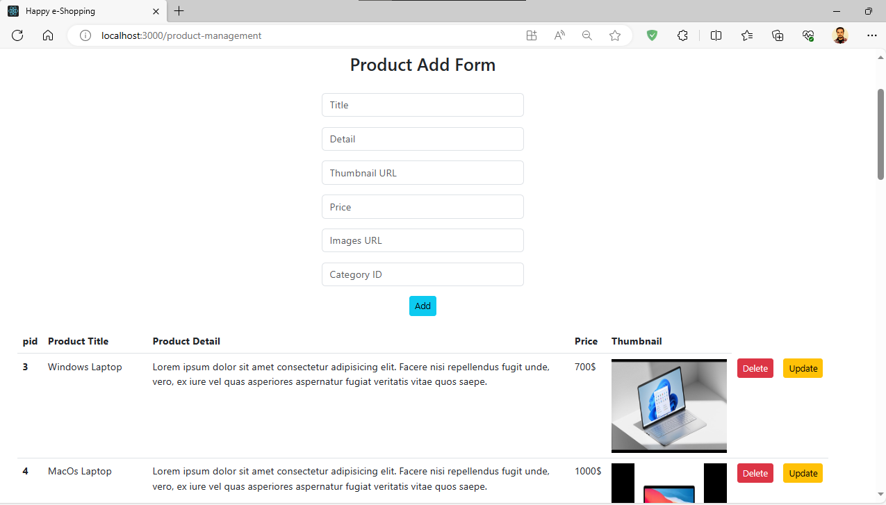 
      </a>
      <a >
          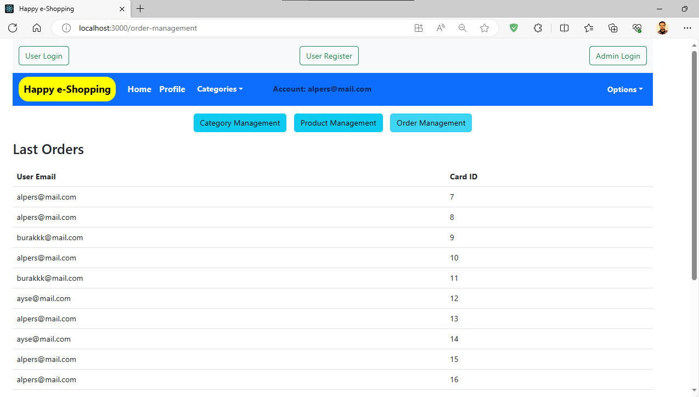 
      </a>

